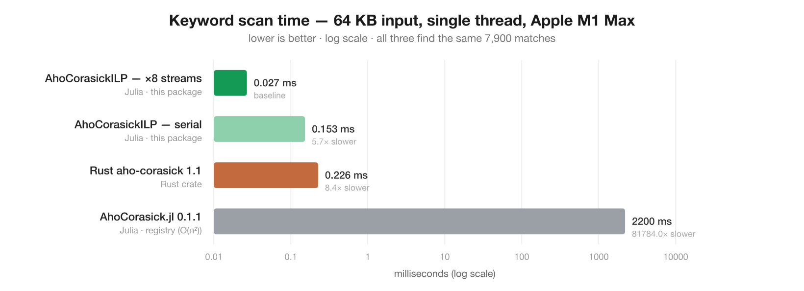

# FastAhoCorasick.jl

[](https://github.com/D3MZ/FastAhoCorasick.jl/actions/workflows/CI.yml)
[](https://codecov.io/gh/D3MZ/FastAhoCorasick.jl)
[](https://D3MZ.github.io/FastAhoCorasick.jl/)
[](LICENSE)

Native-Julia [Aho–Corasick](https://en.wikipedia.org/wiki/Aho%E2%80%93Corasick_algorithm) multi-pattern search that is **allocation-free** and, via a single-thread **multi-stream ILP** kernel, runs **~4.8× faster than Rust's [`aho-corasick`](https://crates.io/crates/aho-corasick) crate** — on one thread, no SIMD, no unsafe tricks the crate couldn't also use. It counts and weight-scores matches, and reports match spans and which pattern hit, over raw UTF-8 bytes.

<p align="center"></p>

| implementation (6 MB corpus, M1 Max, single thread) | min time | throughput | allocations |
|---|---:|---:|---:|
| Rust `aho-corasick` 1.1 (native, LTO) | 11.25 ms | 0.53 GB/s | 3 |
| Julia serial (same algorithm) | 13.02 ms | 0.46 GB/s | **0** |
| **Julia ILP ×8** | **2.33 ms** | **2.57 GB/s** | **0** |

<sub>Identical counts on both sides. Reproduce with `bench/run.sh`.</sub>

## Install

```julia
pkg> add https://github.com/D3MZ/FastAhoCorasick.jl
```

## Usage

```julia
using FastAhoCorasick

a = build(["trading", "strategy", "финансы", "市场"])   # ASCII case-insensitive

count_matches(a, "TRADING Strategy on the 市场")         # 3   — multi-stream, 0 alloc
is_match(a, "no keywords here")                          # false
findfirst_match(a, "xx trading")                         # AcMatch(1, 4, 10)  (pattern, start, stop)
collect_matches(a, "trading 市场")                       # [AcMatch(1,1,7), AcMatch(4,9,14)]

# Zero-alloc streaming callback (accumulate into a Ref, don't reassign a captured local):
hits = Ref(0)
each_match((pattern, start, stop) -> (hits[] += 1), a, "trading and trading")

# Weighted relevance score
w = build(["buy", "sell"]; weights = [1.0, -1.0])
sum_weights(w, "buy buy sell")                           # 1.0

# Case-sensitive matching
cs = build(["ABC"]; casesensitive = true)
count_matches(cs, "abc ABC")                             # 1
```

Matching is on raw **UTF-8 bytes** and folds **ASCII** case only (like the Rust crate's `.ascii_case_insensitive(true)`), so Cyrillic/CJK/Arabic keywords match byte-for-byte. Counts follow `MatchKind::Standard` — leftmost, non-overlapping — identical to Rust's `find_iter().count()`.

## Comparison

The registry's other Aho-Corasick package, [`AhoCorasick.jl`](https://github.com/Wilfridovich17/AhoCorasick.jl) (v0.1.1, GPLv3), and Rust's `aho-corasick` crate target different points in the design space:

| Capability | Rust `aho-corasick` | `AhoCorasick.jl` 0.1.1 | **FastAhoCorasick** |
|---|:---:|:---:|:---:|
| Count non-overlapping | ✓ | ✓ | ✓ |
| Match spans + which pattern | ✓ | ✓ | ✓ |
| `is_match` / first match | ✓ | – | ✓ |
| Overlapping enumeration | ✓ | ✓ | ✗ |
| Per-pattern attached keys | – | ✓ | ✗ |
| Weighted score (`sum_weights`) | – | – | ✓ |
| Case-insensitive | ✓ ASCII | ✓ Unicode | ✓ ASCII |
| Case-sensitive | ✓ | ✓ | ✓ |
| Replace / streaming I/O | ✓ | ✗ | ✗ |
| Multibyte-UTF-8 safe | ✓ | ✗ (`StringIndexError`) | ✓ |
| Allocation-free matching | ✗ (FFI: 3/call) | ✗ | ✓ |
| Time complexity | O(n) | **O(n²)** | O(n) |
| Language · license | Rust · MIT/Unlicense | Julia · GPLv3 | Julia · MIT |

FastAhoCorasick doesn't do overlapping enumeration, per-pattern keys, or replace/streaming; it adds weighted scoring and is the only allocation-free option. Against `AhoCorasick.jl` on ASCII input (it throws on multibyte, and is O(n²) because it recopies `text[2:end]` every character):

| 64 KB ASCII, M1 Max | min time | throughput | allocations |
|---|---:|---:|---:|
| **FastAhoCorasick ILP ×8** | **0.026 ms** | **2,524 MB/s** | **0** |
| `AhoCorasick.jl` 0.1.1 | 1,478 ms | 0.04 MB/s | 2.1 GB |

~57,000× faster and allocation-free. Its quadratic scan grows fast — 2 KB → 1.5 ms, 8 KB → 27 ms, 32 KB → 367 ms — while FastAhoCorasick stays flat (O(n)). Full write-up: [docs → Comparison](https://D3MZ.github.io/FastAhoCorasick.jl/). Reproduce: `Pkg.add("AhoCorasick")` then `julia bench/compare_libraries.jl`.

## How it works

Aho–Corasick matching is a **latency-bound pointer chase**: each step is `state = next[state + class(byte)]`, and the address of every table load depends on the previous load's result. FastAhoCorasick minimizes that one load and then hides its latency:

1. **Cache-resident DFA** (same layout as Rust's). *Byte-class alphabet reduction* collapses all non-pattern bytes into one class so the transition table stays in L1; *premultiplied state ids* remove the multiply from the critical path; and ordering *match states first* turns match detection into a `state < thresh` compare instead of a second load.
2. **Multi-stream ILP** — the single lever past the latency wall. `N` independent DFA chains run in one loop over `N` slices of the input, so the out-of-order engine keeps several otherwise-serial loads in flight at once. **One thread, no SIMD** — just fewer stall cycles. Scales to ~8 streams on the M1 Max.
3. **Exact seams.** Splitting changes where non-overlapping resets land and lets a match straddle a boundary, so each slice is replayed from the true entering state (threaded forward across seams) — provably exact even for periodic patterns like `"aa"/"aaa"`, verified against a naive reference in the [tests](test/runtests.jl).

The serial kernel is a like-for-like port of the crate's DFA and lands within ~1.15× of it (both bounded by L1 latency); the ILP win is a legitimate single-thread optimization that the crate could also adopt. So this is a win for the matcher **as it exists**, not a claim that Julia's compiler beats LLVM on the identical loop.

## Reproduce

```bash
bench/run.sh 6000000    # generate corpus, build native Rust ref, run both, print the table
julia bench/plot.jl     # regenerate bench/benchmark.svg
julia bench/compare_libraries.jl   # vs AhoCorasick.jl (needs Pkg.add("AhoCorasick"))
```

## License

MIT © Demetrius Michael
